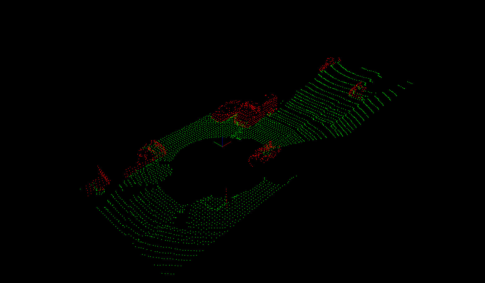
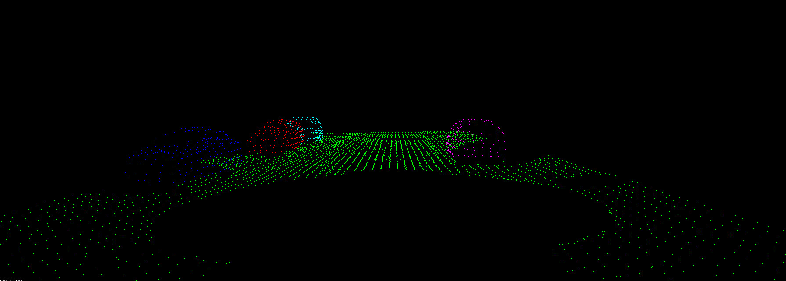
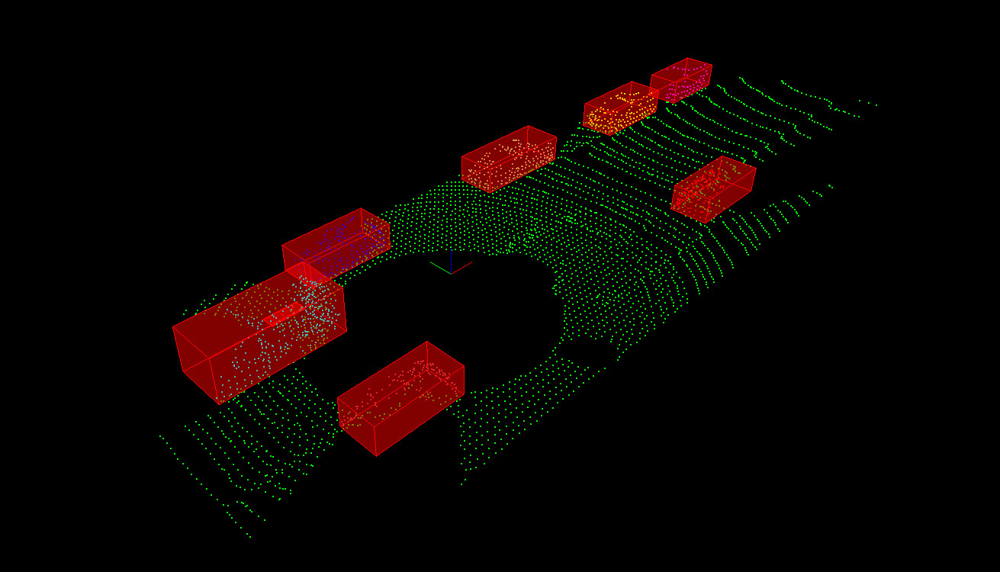

# Lidar obstacle detection project

### Description.

The goal of this project is to implement obstacle detection with data comming from a lidar Point cloud.
The inner algorithms have been implemented from scratch except for point cloud formating and rendering where I used PCL library.
This is a educational project to understand the main algorithms and learn the use of PCL library

### Plane segmentation


### Obstacle clustering


### Obstacle clustering with bounding boxes



### Requirements and installation

You need to install PCL library on your system.

```bash
$> sudo apt install libpcl-dev
$> sudo apt install libproj-dev
```

### Now clone this repository:

```bash
$> git clone https://github.com/eslavaj/lidar_obst_detect.git
```

### To build
```bash
$> cd lidar_obst_detect
$> mkdir build && cd build
$> cmake ..
$> make
```

### To run the application
```bash
$> cd build
$> ./obst_detection
```


